# SQL Access for AI Agents — Flexibility with Guardrails

> How we combined Model Context Protocol with a generalized query pattern to build a flexible, LLM-friendly data access layer

**Reading time:** 15 minutes  
**Skill level:** Intermediate to Advanced  
**Prerequisites:** C#, ASP.NET Core basics, SQL fundamentals

---

## TL;DR

- **Use case:** Operational AI agents that need to query domain data (customer lookup, order status, support history)
- **Challenge:** These agents need bounded, predictable data access — not open-ended database exploration
- **Solution:** Two patterns working together:
  - **MCP (Model Context Protocol)** — Standardized way for LLMs to discover and call tools
  - **Schema-Driven Query Builder** — Generalized, secure SQL generation from JSON config
- **Key insight:** MCP handles the "how LLMs talk to us"; the query builder handles "how we safely access data"
- **Dual interface:** Same query engine powers both MCP (for AI) and REST (for traditional apps)
- **Bonus:** Pluggable database providers — SQLite for instant demos, SQL Server for enterprise
- **Result:** Minimal per-entity boilerplate, secure query boundaries, LLM-native syntax

[Skip to the code →](#getting-started)

---

## Table of Contents

1. [The Use Case](#the-use-case-operational-ai-agents)
2. [The Challenge](#the-challenge-bounded-access-not-open-exploration)
3. [Why Not GraphQL or OData?](#why-not-graphql-or-odata-for-this-use-case)
4. [The Two-Part Solution](#the-two-part-solution)
5. [What is MCP?](#part-1-model-context-protocol-mcp)
6. [The Schema-Driven Query Builder](#part-2-the-schema-driven-query-builder)
7. [Architecture Overview](#technical-architecture)
8. [Dual Interface: MCP + REST](#bonus-dual-interface-mcp--rest)
9. [Query Builder Design](#the-fluent-query-builder)
10. [Security Model](#security-the-allowedfilterfields-boundary)
11. [Challenges & Solutions](#challenges-we-faced)
12. [Getting Started](#getting-started)
13. [What's Next](#whats-next)

---

## The Use Case: Operational AI Agents

Before diving into architecture, let's be clear about **what problem we're solving** — and equally important, what we're *not* solving.

### What We're Building For

Imagine an AI-powered customer support agent. When a user asks:

> *"What's the status of my subscription? I think there was a billing issue last month."*

The agent needs to:
1. **Look up the customer** by email or phone
2. **Check their active subscriptions** and billing status  
3. **Review recent interactions** for context on previous issues
4. **Return relevant data** to formulate a helpful response

These are **operational queries** — bounded lookups against known entities with predictable access patterns:

| Query Type | Example | Characteristics |
|------------|---------|----------------|
| Customer lookup | "Find customer by email" | Single entity, specific identifier |
| Relationship traversal | "Get customer's active subscriptions" | Known joins, filtered results |
| Context gathering | "Recent support interactions" | Time-bounded, limited scope |
| Status checks | "Is subscription active?" | Specific fields, yes/no answers |

### What This Pattern is NOT For

This architecture is **not designed for**:

- **Data analytics** — "What's our churn rate by region?" (needs aggregations across entire tables)
- **Schema exploration** — "What tables exist? What can I query?" (needs dynamic discovery)
- **Ad-hoc reporting** — "Show me all customers who..." (needs unbounded queries)

For those use cases, **text-to-SQL** approaches are more appropriate — they give LLMs broader access to generate arbitrary queries. But that openness comes with tradeoffs in safety and predictability.

### The Key Insight

**Operational agents don't need to query anything — they need to query specific things reliably.**

This distinction shapes everything that follows. We're not restricting LLMs because we don't trust them; we're **constraining the interface** to match the actual requirements of operational workflows.

---

## The Challenge: Bounded Access, Not Open Exploration

Given our use case — operational AI agents performing domain-specific queries — how should we connect them to databases?

The naive approaches have significant drawbacks:

| Approach | Problem |
|----------|--------|
| **Raw SQL generation** | Dangerous for production — even "safe" queries can be malformed or inefficient |
| **Hardcoded API endpoints** | Requires code changes for every new data access pattern |
| **Full database access** | Overkill — operational agents don't need to query everything |
| **Complex parameter validation** | Maintenance nightmare as schemas evolve |

We need something in between: **flexible enough** to handle varied operational queries, but **constrained enough** to be safe and predictable.

But what about established patterns like GraphQL and OData? Surely those solve this problem?

---

## Why Not GraphQL or OData (For This Use Case)?

If you've built data APIs before, you're probably thinking: *"We already have GraphQL and OData for flexible querying. Why not use those?"*

Fair question. GraphQL and OData are **excellent technologies** — for their intended purpose. Let's examine why they're not ideal specifically for **LLM-driven operational queries**:

### GraphQL

```graphql
query GetCustomer {
  customer(email: "john@example.com") {
    name
    subscriptions(where: { status: { _eq: "active" } }) {
      planName
      products { productName, price }
    }
  }
}
```

| GraphQL Strength | LLM Challenge |
|-----------------|---------------|
| Flexible queries | Query syntax is complex — LLMs often generate malformed queries |
| Type system | Requires understanding of schema introspection |
| Nested selections | Deep nesting leads to unpredictable token usage |
| Exact field selection | LLMs tend to over-fetch or under-fetch fields |

**For our use case:** GraphQL was designed for **frontend developers** who learn the schema once and use IDE tooling. LLMs construct queries on every request without prior learning or autocomplete — they need simpler, more constrained interfaces.

### OData

```http
GET /Customers?$filter=email eq 'john@example.com'&$expand=Subscriptions($filter=status eq 'active';$expand=Products)
```

| OData Strength | LLM Challenge |
|----------------|---------------|
| Standardized | Complex URL encoding rules |
| Rich operators | `$filter`, `$expand`, `$select`, `$orderby` — too many concepts |
| Enterprise-ready | Query string syntax is error-prone for LLMs |

**For our use case:** OData's power comes from its rich query language, but for operational queries with known access patterns, that richness is unnecessary complexity. LLMs work better with simpler, JSON-based parameter structures.

### The Fundamental Problem: Genericity vs. Guidance

Here's the insight that shaped our design: **GraphQL and OData optimize for flexibility. LLM tool interfaces need to optimize for clarity.**

When a human developer uses GraphQL, they:
- Read documentation once, internalize the schema
- Use IDE autocomplete and syntax highlighting
- Learn from error messages and iterate
- Build mental models over time

When an LLM calls a tool, it:
- Has no persistent memory of previous calls
- Must construct a valid request from the tool description alone
- Cannot "learn" from mistakes across sessions
- Hallucinates when interfaces are ambiguous

**The more generic the interface, the more room for errors.**


*Note: This is based on our experience building operational agents. Your mileage may vary — some teams successfully use GraphQL with LLMs for specific use cases.*

**Our approach:** Create **domain-specific tools** with constrained, well-described parameters. Instead of "query any entity with any filter," we expose:

- `get_customer_360` — "Get complete customer view by email or phone"
- `get_customer_subscriptions` — "Get subscriptions for a customer"
- `get_customer_products` — "Get products within subscriptions"

Each tool has:
- **Clear purpose** in the name and description
- **Bounded parameters** with explicit allowed values
- **Predictable response shape** documented in the schema
- **Helpful error messages** when parameters are invalid

The schema-driven query builder underneath handles the complexity. The LLM-facing interface stays simple and unambiguous.

### The Best of Both Worlds: Specific Interfaces, Generic Implementation

Here's the architectural trick that makes this scalable:

```mermaid
flowchart TB
    subgraph Tools["Tool Interface Layer (Domain-Specific for LLMs)"]
        T1["get_customer_360"]
        T2["get_customer_subscriptions"]
        T3["get_customer_products"]
        T4["... add more with<br/>minimal code!"]
    end
    
    subgraph Builder["Schema-Driven Query Builder (Generic Implementation)"]
        B1["• Reads entity definitions from entities.json"]
        B2["• Parses MongoDB-style filters"]
        B3["• Generates parameterized SQL"]
        B4["• Handles JOINs and relationships automatically"]
        B5["• Enforces security boundaries"]
    end
    
    T1 --> Builder
    T2 --> Builder
    T3 --> Builder
    T4 --> Builder
```



**What this means for adding new tools:**

Adding a new domain query tool (e.g., `get_customer_invoices`) requires:

1. **Add entity to `entities.json`** — Define table, fields, relationships
2. **Add one tool method** — ~10 lines of C# that delegates to the query builder

```csharp
// That's it. The entire tool implementation:
[McpServerTool, Description("Get invoices for a customer")]
public async Task<DomainQueryResult> GetCustomerInvoices(
    EntityFilter profile,
    EntityFilter? invoice = null,
    CancellationToken ct = default)
{
    return await _queryBuilder.Create()
        .From("CustomerProfile")
        .Where(profile)
        .WithRelated("Invoice", invoice)
        .ExecuteAsync(ct);
}
```

**No SQL writing. No parameter validation code. No response mapping.**

The query builder reads `entities.json` and handles:
- ✅ SQL generation with proper JOINs
- ✅ Parameter binding (SQL injection prevention)
- ✅ Field allowlist enforcement
- ✅ Relationship traversal
- ✅ Response shaping

This is the key insight: **Constrain the interface for LLM reliability, but keep the implementation generic for developer velocity.**

### What Operational AI Agents Actually Need

| Requirement | GraphQL/OData | Our Approach |
|-------------|---------------|--------------|
| **Familiar syntax** | Custom DSL to learn | MongoDB-style JSON (LLMs are trained on this) |
| **Flat parameter structure** | Nested/URL-encoded | Simple JSON objects |
| **Bounded flexibility** | Full schema access | Explicit allowlists per entity |
| **Error tolerance** | Strict parsing | Graceful validation with helpful messages |
| **Predictable responses** | Variable shapes | Consistent structure per tool |

The key insight: **For operational queries, LLMs don't need maximum flexibility — they need maximum predictability with bounded flexibility.**

This led us to a **self-describing, schema-driven query layer** optimized for the operational AI agent use case.

---

## The Two-Part Solution

Our solution combines **two distinct architectural patterns**, each solving a different part of the problem:


| Pattern | What It Solves | Key Benefit |
|---------|---------------|-------------|
| **Model Context Protocol (MCP)** | How LLMs discover and invoke tools | Standardized interface, tool schemas, cross-platform compatibility |
| **Schema-Driven Query Builder** | How tools safely access data | Minimal boilerplate, secure boundaries, LLM-friendly filter syntax |

**Neither pattern alone is sufficient:**
- MCP without a good query pattern → You still write boilerplate for every entity
- Query builder without MCP → No standardized way for LLMs to discover capabilities

Let's examine each pattern in detail.

---

## Part 1: Model Context Protocol (MCP)

[Model Context Protocol](https://modelcontextprotocol.io/) is an open standard that defines how AI applications communicate with external data sources and tools. Think of it as a **universal adapter** between LLMs and your backend systems.

### What MCP Provides


- **Tool discovery** — LLMs can ask "what can you do?"
- **Structured parameters** — Type-safe inputs with descriptions
- **Consistent responses** — Predictable output formats

### What MCP Does NOT Provide

MCP is a **protocol**, not an implementation. It doesn't tell you:
- How to structure your database queries
- How to validate filter parameters
- How to handle relationships between entities
- How to prevent SQL injection or unauthorized field access

**That's where our schema-driven query builder comes in.**

For our .NET solution, we chose the official [C# MCP SDK](https://github.com/modelcontextprotocol/csharp-sdk) which integrates seamlessly with ASP.NET Core.

---

## Part 2: The Schema-Driven Query Builder

This is where the real architectural innovation lives. While MCP handles communication, the query builder handles **safe, flexible data access**.

### The Core Insight

**Entities are just configuration.** Every database table becomes an entry in `entities.json`:


### Layer Responsibilities

| Layer | Component | Role |
|-------|-----------|------|
| Transport | MCP/REST | Protocol handling |
| Tools | `DomainQueryTools` | MCP tool definitions |
| Services | `DomainQueryBuilder` | SQL generation |
| Config | `entities.json` | Schema definitions |
| Data | IDatabaseProvider + Dapper | Pluggable database (SQLite/SQL Server) |

Notice how MCP (transport layer) and the Query Builder (service layer) have distinct responsibilities. The tools layer is the **glue** that connects them.

---

## Bonus: Dual Interface (MCP + REST)

Here's something we haven't emphasized enough: **this solution isn't just for AI agents**.

Because the schema-driven query builder is transport-agnostic, we expose the **same capabilities** through both MCP (for LLMs) and REST (for traditional applications):

```mermaid
flowchart LR
    subgraph Clients
        AI[🤖 AI Agent / Copilot]
        Web[🌐 Web App]
        Mobile[📱 Mobile App]
        Script[⚡ Scripts / Automation]
    end
    
    subgraph Endpoints
        MCP["/mcp<br/>MCP Protocol"]
        REST["/api/customer/*<br/>REST API"]
    end
    
    subgraph Core["Shared Query Engine"]
        QB[DomainQueryBuilder]
    end
    
    AI --> MCP
    Web --> REST
    Mobile --> REST
    Script --> REST
    MCP --> QB
    REST --> QB
```



### Same Query, Two Interfaces

**Via MCP (for AI agents):**
```json
// Tool call: get_customer_360
{
  "profile": { "email": "john@example.com" },
  "subscription": { "status": "active" }
}
```

**Via REST (for traditional apps):**
```bash
curl -X POST http://localhost:5000/api/customer/360 \
  -H "Content-Type: application/json" \
  -d '{
    "profile": { "email": "john@example.com" },
    "subscription": { "status": "active" }
  }'
```

**Same request body. Same response. Same query builder underneath.**

### Why This Matters

| Benefit | Impact |
|---------|--------|
| **Incremental AI adoption** | Add AI capabilities without replacing existing integrations |
| **Unified data access** | One query pattern for all consumers |
| **Testing flexibility** | Debug with curl/Postman before connecting AI agents |
| **Future-proof** | REST works today; MCP ready for AI-first future |
| **Team collaboration** | Backend devs use REST; AI devs use MCP |

> **Key insight:** The query builder pattern is the real asset. MCP and REST are just different windows into the same capability.

---

## Schema-Driven Configuration

The key insight that shaped our design: **entities are just configuration**. Every database table becomes an entry in `entities.json`:

```json
{
  "entities": {
    "CustomerProfile": {
      "tableName": "CustomerProfile",
      "identifierField": "customer_id",
      "fields": {
        "customer_id": { "type": "string", "description": "Unique customer identifier" },
        "name": { "type": "string", "description": "Full name" },
        "email": { "type": "string", "description": "Email address" },
        "phone": { "type": "string", "description": "Phone number" }
      },
      "allowedFilterFields": ["customer_id", "email", "phone"],
      "relationships": {
        "Subscription": { "foreignKey": "customer_id", "type": "one-to-many" },
        "Interaction": { "foreignKey": "customer_id", "type": "one-to-many" }
      }
    }
  }
}
```

### What The Query Builder Pattern Buys Us

This schema-driven approach (independent of MCP) provides:

1. **Minimal per-entity boilerplate** — New entities need only JSON config + ~10 lines of tool code (no SQL, no validation, no mapping)
2. **Self-documenting** — Field descriptions flow to LLM prompts via MCP tool schemas
3. **Safe boundaries** — `allowedFilterFields` controls what can be queried (security by design)
4. **Relationship awareness** — JOINs are handled automatically based on config
5. **Database agnostic** — Same pattern works for SQLite, SQL Server, PostgreSQL, etc.

> **Key point:** These benefits come from the **query builder pattern**, not from MCP. MCP simply provides the transport layer that exposes these capabilities to LLMs.

---

## MongoDB-Style Filters: Speaking the LLM's Language

Here's our critical design decision: **use MongoDB-inspired query syntax**.

Why? Because every major LLM has been trained on MongoDB documentation. They already know how to construct these filters. We implement a practical subset of MongoDB operators that map cleanly to SQL:

```json
{
  "status": "active",
  "start_date": { "$gte": "2025-01-01" },
  "plan_name": { "$like": "%Enterprise%" }
}
```

### Supported Operators

We support the most commonly used comparison and set operators. Note: logical operators like `$and`, `$or`, `$not` are not currently implemented — filters use implicit AND.

| Operator | SQL | Example |
|----------|-----|---------|
| `$eq` | `=` | `{ "status": { "$eq": "active" } }` |
| `$ne` | `!=` | `{ "status": { "$ne": "cancelled" } }` |
| `$gt`, `$gte` | `>`, `>=` | `{ "price": { "$gte": 100 } }` |
| `$lt`, `$lte` | `<`, `<=` | `{ "quantity": { "$lt": 5 } }` |
| `$in`, `$nin` | `IN`, `NOT IN` | `{ "status": { "$in": ["active", "pending"] } }` |
| `$like` | `LIKE` | `{ "name": { "$like": "%John%" } }` |

### Per-Entity Limits

Each entity filter can include `$limit` for fine-grained control:

```json
{
  "subscription": { "status": "active", "$limit": 5 },
  "product": { "$limit": 10 }
}
```

---

## The Fluent Query Builder

The heart of our system is the `DomainQueryBuilder` with its chainable API:

```csharp
return await _queryBuilder.Create()
    .From("CustomerProfile")
    .Where(profile)                                    // MongoDB filter
    .WithRelated("Subscription", subscriptionFilter)
    .WithRelated("Product", productFilter, parent: "Subscription")
    .WithRelated("Interaction", interactionFilter)
    .ExecuteAsync(ct);
```

### Key Design Elements

**1. Explicit Parent Chains**

For nested relationships (like `Product` under `Subscription`), we require explicit `parent:` specification:

```csharp
.WithRelated("Product", filter, parent: "Subscription")
```

This clarity prevents ambiguous JOINs when entities could relate through multiple paths.

**2. Output Shaping with Select() and SelectFields()**

Control what's returned:

```csharp
// Return only specific entities
.Select("Subscription", "Product")

// Return only specific fields per entity (C# 12 syntax)
.SelectFields("Subscription", ["plan_name", "status"])
.SelectFields("Product", ["product_name", "price"])
```

**3. Single JOIN Query**

Instead of N+1 queries, we generate a single JOIN with `ROW_NUMBER()` for deduplication:

```sql
WITH ranked AS (
  SELECT cp.*, s.*, p.*,
    ROW_NUMBER() OVER (PARTITION BY cp.customer_id ORDER BY s.start_date DESC) as rn
  FROM CustomerProfile cp
  LEFT JOIN Subscription s ON cp.customer_id = s.customer_id
  LEFT JOIN Product p ON s.id = p.subscription_id
  WHERE cp.email = @email
)
SELECT * FROM ranked WHERE rn <= @limit
```

---

## Security: The `allowedFilterFields` Boundary

**Security is non-negotiable** when LLMs interact with databases. Our schema includes an explicit allowlist:

```json
{
  "CustomerProfile": {
    "fields": {
      "customer_id": { ... },
      "name": { ... },
      "email": { ... },
      "phone": { ... },
      "internal_notes": { ... },     // Sensitive!
      "credit_score": { ... }         // Sensitive!
    },
    "allowedFilterFields": ["customer_id", "email", "phone"]  // ← Only these!
  }
}
```

### What This Prevents

- ❌ `{ "credit_score": { "$gte": 700 } }` — Rejected
- ❌ `{ "internal_notes": { "$like": "%VIP%" } }` — Rejected
- ✅ `{ "email": "user@example.com" }` — Allowed

The query builder enforces this boundary **before** SQL generation.

---

## MCP Tool Implementation

Here's a complete tool definition:

```csharp
[McpServerToolType]
public class DomainQueryTools
{
    private readonly IDomainQueryBuilder _queryBuilder;

    public DomainQueryTools(IDomainQueryBuilder queryBuilder)
    {
        _queryBuilder = queryBuilder;
    }

    [McpServerTool(Name = "get_customer_360")]
    [Description("Get complete customer view with subscriptions, products, and interaction history.")]
    public async Task<DomainQueryResult> GetCustomer360(
        [Description("MongoDB filter for CustomerProfile. Fields: customer_id, email, phone, name.")]
        EntityFilter profile,

        [Description("MongoDB filter for Subscription. Fields: plan_name, status, start_date.")]
        EntityFilter? subscription = null,

        [Description("MongoDB filter for Product. Fields: product_name, sku, price.")]
        EntityFilter? product = null,

        [Description("MongoDB filter for Interaction. Fields: summary, channel, timestamp.")]
        EntityFilter? interaction = null,

        CancellationToken ct = default)
    {
        return await _queryBuilder.Create()
            .From("CustomerProfile")
            .Where(profile)
            .WithRelated("Subscription", subscription)
            .WithRelated("Product", product, parent: "Subscription")
            .WithRelated("Interaction", interaction)
            .ExecuteAsync(ct);
    }
}
```

The `[Description]` attributes flow directly to the LLM during tool discovery, providing context about available fields and filter options.

---

## Challenges We Faced

### Challenge 1: Nested Relationship JOINs

**Problem:** When `Product` belongs to `Subscription` which belongs to `CustomerProfile`, the JOIN chain must be correct.

**Solution:** Explicit parent specification and relationship traversal:

```csharp
// In entities.json
"Subscription": {
  "relationships": {
    "CustomerProfile": { "foreignKey": "customer_id", "type": "many-to-one" },
    "Product": { "foreignKey": "id", "localKey": "subscription_id", "type": "one-to-many" }
  }
}
```

### Challenge 2: Duplicate Rows in JOINs

**Problem:** One-to-many JOINs produce duplicate parent rows.

**Solution:** `ROW_NUMBER()` window functions for deduplication:

```sql
ROW_NUMBER() OVER (PARTITION BY parent_id ORDER BY child_field DESC) as rn
```

### Challenge 3: LLM Filter Interpretation

**Problem:** LLMs sometimes sent malformed filters or tried to access restricted fields.

**Solution:** Robust parsing with clear error messages:

```csharp
public List<FilterCondition> ToConditions(string entityName, EntitySchema schema)
{
    foreach (var kvp in Filters)
    {
        var field = kvp.Key;
        if (field.StartsWith("$")) continue;  // Skip operators
        
        if (!schema.AllowedFilterFields.Contains(field))
        {
            throw new InvalidOperationException(
                $"Field '{field}' is not allowed for filtering on {entityName}. " +
                $"Allowed: {string.Join(", ", schema.AllowedFilterFields)}");
        }
    }
}
```

---

## Getting Started

### Prerequisites

- .NET 8 SDK
- **That's it!** SQLite is the default — no database installation required.

### Quick Start

```bash
git clone https://github.com/sanchar10/mcp-sql-query-dotnet.git
cd mcp-sql-query-dotnet
dotnet run

# Server starts at http://localhost:5000
# MCP: /mcp
# REST: /api/customer/*
# Swagger: /swagger
```

On first run, the application automatically:
1. Creates the SQLite database file
2. Generates all tables with proper indexes
3. Seeds realistic sample data (customers, subscriptions, products, interactions)

### Switching to SQL Server (Enterprise)

For production scenarios, switch to SQL Server with a single config change:

```json
// appsettings.json
{
  "Database": {
    "Provider": "SqlServer"  // Change from "SQLite"
  },
  "ConnectionStrings": {
    "SqlServer": "Server=localhost\\SQLEXPRESS;Database=CustomerMCP;Trusted_Connection=True;TrustServerCertificate=True;"
  }
}
```

The application will automatically create the `CustomerMCP` database on SQL Server Express if it doesn't exist.

### Test with curl

```bash
curl -X POST http://localhost:5000/api/customer/360 \
  -H "Content-Type: application/json" \
  -d '{
    "profile": { "email": "john.doe@example.com" },
    "subscription": { "status": "active" }
  }'
```

### Test with MCP Inspector

```bash
npx @anthropic-ai/mcp-inspector
# Connect to http://localhost:5000/mcp
```

---

## What's Next

This architecture opens several exciting possibilities:

1. ✅ **Multiple Database Backends** — Already implemented! Switch between SQLite and SQL Server via config
2. **PostgreSQL/MySQL Support** — Extend `IDatabaseProvider` for additional databases
3. **Caching Layer** — Add Redis caching for frequently-accessed customer profiles
4. **Rate Limiting** — Implement per-tool rate limits for AI agent consumption
5. **Audit Logging** — Track which LLM queries accessed which data
6. **Multi-Tenant Support** — Extend schema with tenant isolation

---

## Key Takeaways

### On the Two-Pattern Approach

| Pattern | Contribution |
|---------|-------------|
| **MCP** | Standardized protocol for LLM ↔ tool communication |
| **Schema-Driven Query Builder** | Generalized, secure, configuration-driven data access |

**Together, they solve the complete problem:**

```
LLM → [MCP: Discovery & Invocation] → [Query Builder: Safe SQL Generation] → Database
```

### Architectural Principles

1. **Separation of concerns** — MCP handles communication; query builder handles data access
2. **Schema-driven design** — Entities are configuration, not code
3. **MongoDB-style syntax** — Leverages existing LLM training for filter construction
4. **Explicit security boundaries** — Field allowlists prevent unauthorized access
5. **Database abstraction** — Same pattern works across SQLite, SQL Server, and beyond
6. **Fluent composition** — Complex queries remain readable and maintainable

### When to Use This Pattern

✅ **Good fit:**
- Operational queries for specific business functions (customer lookup, order status, support history)
- Multi-entity databases with relationships
- AI agents that need flexible querying
- Teams wanting to add new queries with minimal boilerplate
- Production systems requiring security boundaries

❌ **May be overkill for:**
- Single-entity, simple CRUD APIs
- Systems where LLMs only need fixed, predefined queries

❌ **Not the right fit for:**
- **Data analytics scenarios** where LLMs need to dynamically explore the entire database, discover schemas, or run arbitrary aggregations. For those use cases, consider text-to-SQL approaches that give the LLM broader access to generate ad-hoc queries.

> **Note:** This pattern is intentionally focused on **read operations**. For AI agents, queries are the primary use case—you want AI to *retrieve* customer data, not accidentally modify it. Write operations typically require additional validation, approval workflows, and audit trails that are better handled through explicit, purpose-built endpoints.

The complete source code is available on [GitHub](https://github.com/sanchar10/mcp-sql-query-dotnet).

---

## Resources

- [Model Context Protocol Specification](https://modelcontextprotocol.io/)
- [C# MCP SDK](https://github.com/modelcontextprotocol/csharp-sdk)
- [MongoDB Query Syntax (inspiration)](https://www.mongodb.com/docs/compass/current/query/filter/)
- [Dapper ORM](https://github.com/DapperLib/Dapper)

---

*Found this useful? Follow me for more AI architecture deep-dives. Have questions? Drop a comment below!*
